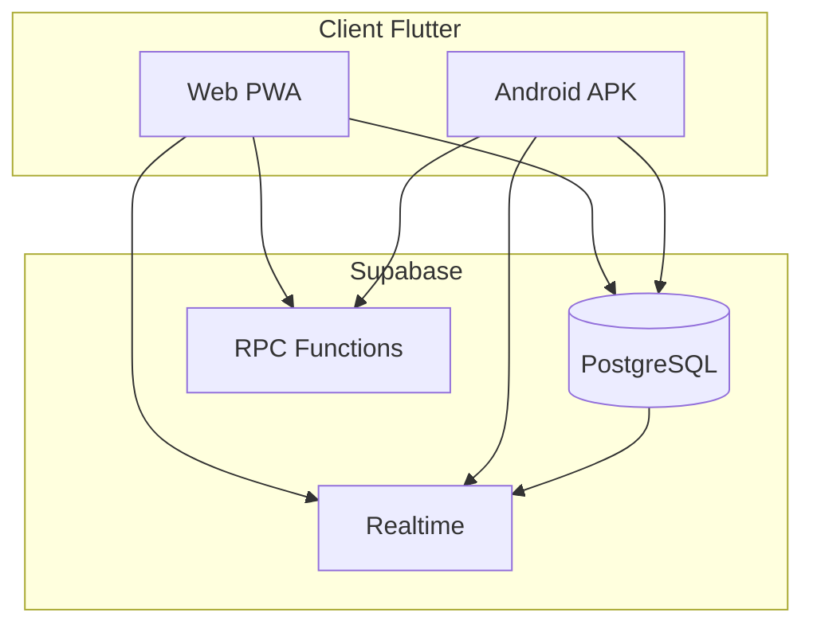
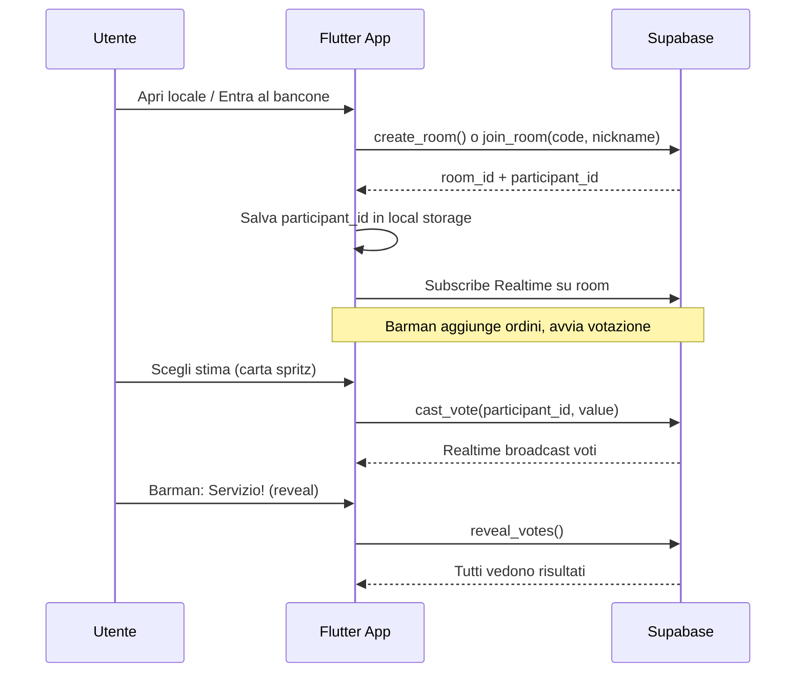

# SpritzPlanning — Piano di implementazione

## Contesto

Workspace **greenfield** ([d:\source\SpritzPlanning](d:\source\SpritzPlanning)): nessun codice esistente. Stack scelto: **Flutter + Dart + Material 3**, backend **Supabase** (PostgreSQL + Realtime), UI **solo italiano** con terminologia bar/spritz.

## Architettura



### Flusso utente



## Glossario Spritz (UI + codice interno)

| Concetto Scrum | Termine UI (IT) | Identificatore codice |
|----------------|-----------------|----------------------|
| Room | Locale / Bar | `room` |
| Room code | Codice bancone | `code` (es. `SPRT-A3K9`) |
| Participant | Cliente | `participant` |
| Facilitator | Barman | `isFacilitator` |
| User story | Ordine | `story` |
| Backlog | Menu | `menu` |
| Vote / estimate | Bicchiere / Dose | `vote` |
| Reveal | Servizio! | `reveal` |
| Join | Entra al bancone | — |
| Create room | Apri un locale | — |
| Waiting | In attesa dell'aperitivo | `lobby` |
| Coffee break card | Pausa caffè | `coffee` |
| Unsure | Non ho sete / ? | `unsure` |

**Deck Fibonacci** (carte stile bicchieri spritz con valori standard): `0, ½, 1, 2, 3, 5, 8, 13, 21, ?, ☕`

## Schema database Supabase

File: [`supabase/migrations/001_initial_schema.sql`](supabase/migrations/001_initial_schema.sql)

```sql
-- Tabelle principali
rooms (id, code, name, created_at, settings jsonb)
participants (id, room_id, nickname, is_facilitator, joined_at, last_seen_at)
stories (id, room_id, title, description, sort_order, status, final_estimate)
votes (id, story_id, participant_id, value, voted_at) -- UNIQUE(story_id, participant_id)
```

**Stato sessione** (colonna su `rooms` o tabella `room_sessions`):
- `phase`: `lobby` | `voting` | `revealed`
- `current_story_id`: FK nullable
- `votes_revealed`: boolean

**RPC functions** (logica server-side, no auth obbligatoria):
- `create_room(p_name, p_nickname)` → crea room + barman participant, ritorna `code`, `room_id`, `participant_id`
- `join_room(p_code, p_nickname)` → aggiunge participant
- `add_story`, `start_voting`, `cast_vote`, `reveal_votes`, `reset_votes`, `set_final_estimate`, `next_story`
- `generate_room_code()` → codice leggibile tipo `SPRT-XXXX`

**RLS senza login**: policy permissive per anon su tabelle scoped per `room_id`. Sicurezza basata su:
- Codice stanza difficile da indovinare (6-8 char alfanumerici)
- `participant_id` (UUID) salvato localmente — richiesto per mutazioni voti via RPC
- Rate limiting su `create_room` (Supabase Edge Function o limite applicativo)

**Realtime**: abilitare publication su `participants`, `stories`, `votes`, `rooms` filtrate per `room_id`.

## Struttura progetto Flutter

```
spritz_planning/
├── lib/
│   ├── main.dart
│   ├── app.dart
│   ├── core/
│   │   ├── theme/          # Material 3 tema spritz (arancione, verde oliva, crema)
│   │   ├── constants/      # deck values, copy UI
│   │   └── storage/        # participant_id persistence (shared_preferences)
│   ├── data/
│   │   ├── models/         # Room, Participant, Story, Vote
│   │   ├── repositories/   # RoomRepository, StoryRepository
│   │   └── supabase/       # client init, RPC wrappers
│   ├── features/
│   │   ├── home/           # Landing: Apri locale / Entra al bancone
│   │   ├── lobby/          # Lista clienti, menu ordini, controlli barman
│   │   └── voting/         # Carte spritz, stato votazione, reveal
│   └── shared/widgets/     # SpritzCard, ParticipantAvatar, RoomCodeDisplay
├── supabase/
│   └── migrations/
├── web/
├── android/
├── .cursor/
│   ├── rules/
│   └── skills/
└── test/
```

**Dipendenze chiave** (`pubspec.yaml`):
- `supabase_flutter` — client + realtime
- `flutter_riverpod` — state management
- `go_router` — navigazione
- `shared_preferences` — persistenza participant_id
- `uuid` — generazione ID lato client se necessario

## Design UI (Material 3 + tema Spritz)

Palette ispirata allo spritz:
- **Primary**: arancione corallo (`#E8651A`) — colore spritz
- **Secondary**: verde oliva (`#6B7B3C`) — foglia d'arancio
- **Surface**: crema/bianco sporco (`#FFF8F0`) — bancone bar
- **Typography**: Material 3 default, titoli con personalità ma leggibili

**Schermate MVP**:

1. **Home** — hero "SpritzPlanning", due CTA: "Apri un locale" / "Entra al bancone", campo nickname
2. **Lobby** — codice bancone condivisibile (copy/share), lista clienti con badge "Barman", sezione Menu (backlog ordini), FAB barman per aggiungere ordine
3. **Votazione** — ordine corrente in evidenza, griglia carte bicchiere, indicatori clienti che hanno votato (senza mostrare valore), pulsante barman "Servizio!"
4. **Reveal** — animazione reveal, distribuzione voti, consenso/discussione, "Conferma stima" + "Prossimo ordine"

**Responsive**: layout adattivo web (griglia larga) vs mobile (scroll verticale, carte in carousel).

## Fasi di implementazione

### Fase 1 — Scaffolding e fondamenta
- `flutter create spritz_planning --platforms=web,android`
- Configurare Supabase project + env (`SUPABASE_URL`, `SUPABASE_ANON_KEY`) via `--dart-define` o file `.env` con `flutter_dotenv`
- Migration SQL iniziale + seed deck constants
- Tema Material 3 spritz in [`lib/core/theme/app_theme.dart`](lib/core/theme/app_theme.dart)
- Setup Riverpod + go_router

### Fase 2 — Backend e data layer
- Modelli Dart + repository con RPC Supabase
- Realtime subscription manager (join/leave channel per room)
- Local storage per `participant_id` e `room_id` (ripristino sessione)

### Fase 3 — Feature Home + Lobby
- Form creazione/join con validazione nickname
- Lobby con lista partecipanti realtime
- CRUD ordini (solo barman può aggiungere/rimuovere/riordinare)

### Fase 4 — Feature Votazione (core Scrum Poker)
- Flusso: barman seleziona ordine → `start_voting` → clienti votano → `reveal_votes`
- UI carte con feedback tattile (vibration Android)
- Stato "tutti hanno votato" visibile al barman
- Reset voti per nuovo round sullo stesso ordine

### Fase 5 — Polish e deploy
- Animazioni reveal, empty states tematici ("Il bancone è vuoto...")
- Condivisione codice stanza (share sheet Android, clipboard web)
- Test widget su flusso votazione
- Deploy: Supabase hosted + web su Vercel/Netlify + build Android APK

## Artefatti AI (skill + regole Cursor)

Da creare in fase 1 per guidare tutto lo sviluppo successivo:

### Regole (`.cursor/rules/`)

| File | Scope | Contenuto |
|------|-------|-----------|
| [`spritz-theme.mdc`](.cursor/rules/spritz-theme.mdc) | `lib/**/*.dart` | Palette, copy italiano obbligatorio, glossario bar/spritz, no termini Scrum in UI |
| [`flutter-architecture.mdc`](.cursor/rules/flutter-architecture.mdc) | `lib/**/*.dart` | Riverpod + repository pattern, feature-first folders, no logic in widgets |
| [`supabase-realtime.mdc`](.cursor/rules/supabase-realtime.mdc) | `supabase/**`, `lib/data/**` | RPC per mutazioni, Realtime per letture, RLS patterns, no auth |

### Skill (`.cursor/skills/`)

| Skill | Trigger | Contenuto |
|-------|---------|-----------|
| [`spritz-planning-domain/SKILL.md`](.cursor/skills/spritz-planning-domain/SKILL.md) | Scrum poker, votazione, stanze | Glossario completo, flussi UX, regole barman, edge cases |
| [`supabase-migrations/SKILL.md`](.cursor/skills/supabase-migrations/SKILL.md) | Migration SQL, RPC | Template migration, naming conventions, checklist RLS |

### AGENTS.md (root)

Brief per agenti AI: stack, comandi (`flutter run`, `supabase db push`), struttura cartelle, link a glossario, vincoli (UI italiana, no login, tema spritz).

## Decisioni tecniche chiave

- **No login**: identità = nickname + UUID participant; sufficiente per tool interno team
- **Barman**: il creatore della stanza; trasferibile via RPC `transfer_facilitator` (nice-to-have post-MVP)
- **Persistenza stanze**: stanze attive con cleanup automatico dopo 24h inattività (cron Supabase o TTL su `last_activity_at`)
- **Offline**: fuori scope MVP; mostrare banner "Connessione persa al bancone"
- **i18n**: stringhe centralizzate in [`lib/core/constants/app_strings.dart`](lib/core/constants/app_strings.dart) per facilitare EN in futuro senza refactor

## Rischi e mitigazioni

| Rischio | Mitigazione |
|---------|-------------|
| Abuso anon key | RPC con validazioni, rate limit create_room, RLS scoped |
| Vote spoofing | Mutazioni solo via RPC con participant_id valido nella room |
| Stanze abbandonate | Cleanup job + TTL |
| Realtime disconnessione | Reconnect automatico + polling fallback |

## Comandi di sviluppo

```bash
# Setup
flutter pub get
supabase init && supabase start   # dev locale
supabase db push                  # applica migration

# Run
flutter run -d chrome --dart-define-from-file=env.json
flutter run -d android

# Test
flutter test
```

## Deliverable MVP

Al termine dell'implementazione avrai:
- App Flutter funzionante su **browser** e **Android**
- Creazione/accesso stanze con **nickname** (no login)
- **Scrum poker** completo: backlog, votazione, reveal, stima finale
- **Tema Spritz/bar** coerente in UI e copy
- Backend **Supabase** con sync realtime
- **Skill + regole Cursor** per sviluppo AI-assisted
