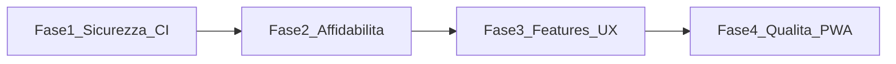

# SpritzPlanning — Roadmap miglioramenti

Piano di evoluzione per i punti **1–9** (i18n / punto 10 escluso per ora).

## Panoramica fasi

| Fase | Punti | Durata stimata | Branch suggerito | Documento |
|------|-------|----------------|------------------|-----------|
| 1 | #1, #9, #3 | 3–5 giorni | `feat/security-and-ci` | [phase-1-security-ci.md](plans/phase-1-security-ci.md) |
| 2 | #2 | 2–3 giorni | `feat/realtime-resilience` | [phase-2-realtime.md](plans/phase-2-realtime.md) |
| 3 | #4, #7, #8 | 4–6 giorni | `feat/lobby-voting-ux` | [phase-3-lobby-voting-ux.md](plans/phase-3-lobby-voting-ux.md) |
| 4 | #5, #6 | 4–5 giorni | `feat/e2e-and-pwa` | [phase-4-quality-pwa.md](plans/phase-4-quality-pwa.md) |

## Lista miglioramenti (priorità originale)

Vedi [IMPROVEMENTS.md](IMPROVEMENTS.md) per l’elenco completo con importanza e complessità.

| # | Miglioramento | In roadmap |
|---|-------------|------------|
| 1 | Sicurezza RLS e RPC | Fase 1 |
| 2 | Realtime resiliente | Fase 2 |
| 3 | Cleanup stanze | Fase 1 |
| 4 | Trasferimento Barman | Fase 3 |
| 5 | Test E2E votazione | Fase 4 |
| 6 | PWA | Fase 4 |
| 7 | QR codice bancone | Fase 3 |
| 8 | Dashboard votazione | Fase 3 |
| 9 | CI/CD GitHub Actions | Fase 1 |
| 10 | i18n | Non pianificato |

## Ordine di esecuzione

1. **Fase 1** — prerequisito produzione (sicurezza + CI + housekeeping DB)
2. **Fase 2** — stabilità percepita (reconnect Realtime)
3. **Fase 3** — valore UX per il team (barman, QR, summary voti)
4. **Fase 4** — qualità e reach web (test integrazione, PWA)

## Stato implementazione

Aggiornare questa tabella al completamento di ogni fase:

| Fase | Stato | PR / commit |
|------|-------|-------------|
| 1 | Completata | migrations 002–004, `.github/workflows/ci.yml` |
| 2 | Completata | `RealtimeConnectionManager`, `ConnectionBanner` |
| 3 | Completata | transfer barman, QR join, vote summary |
| 4 | Completata | integration_test, PWA manifest, install banner |

## Riferimenti codice

- Schema DB: [`supabase/migrations/`](../supabase/migrations/)
- Data layer: [`lib/data/`](../lib/data/)
- UI: [`lib/features/`](../lib/features/)
- Deploy: [`vercel.json`](../vercel.json), [`scripts/vercel-build.sh`](../scripts/vercel-build.sh)
