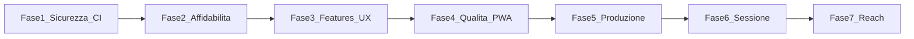

# SpritzPlanning — Roadmap miglioramenti

Piano di evoluzione: punti **1–9** completati (fasi 1–4); punti **11–20** pianificati (fasi 5–7).

## Panoramica fasi

| Fase | Punti | Durata stimata | Branch suggerito | Documento |

|------|-------|----------------|------------------|-----------|

| 1 | #1, #9, #3 | 3–5 giorni | `feat/security-and-ci` | [phase-1-security-ci.md](plans/phase-1-security-ci.md) |

| 2 | #2 | 2–3 giorni | `feat/realtime-resilience` | [phase-2-realtime.md](plans/phase-2-realtime.md) |

| 3 | #4, #7, #8 | 4–6 giorni | `feat/lobby-voting-ux` | [phase-3-lobby-voting-ux.md](plans/phase-3-lobby-voting-ux.md) |

| 4 | #5, #6 | 4–5 giorni | `feat/e2e-and-pwa` | [phase-4-quality-pwa.md](plans/phase-4-quality-pwa.md) |

| 5 | #17, #15 | 3–5 giorni | `feat/observability-and-export` | [phase-5-production-value.md](plans/phase-5-production-value.md) |

| 6 | #13, #14, #19 | 6–9 giorni | `feat/session-ux` | [phase-6-session-ux.md](plans/phase-6-session-ux.md) |

| 7 | #11, #12, #16, #18, #20 | 10–14 giorni | `feat/reach-and-polish` | [phase-7-reach-polish.md](plans/phase-7-reach-polish.md) |

## Lista miglioramenti v1 (#1–10)

Vedi [IMPROVEMENTS.md](IMPROVEMENTS.md).

| # | Miglioramento | Fase | Stato |

|---|-------------|------|-------|

| 1 | Sicurezza RLS e RPC | 1 | Completata |

| 2 | Realtime resiliente | 2 | Completata |

| 3 | Cleanup stanze | 1 | Completata |

| 4 | Trasferimento Barman | 3 | Completata |

| 5 | Test E2E votazione | 4 | Completata |

| 6 | PWA | 4 | Completata |

| 7 | QR codice bancone | 3 | Completata |

| 8 | Dashboard votazione | 3 | Completata |

| 9 | CI/CD GitHub Actions | 1 | Completata |

| 10 | i18n (originale) | → #11 Fase 7 | Pianificata |

## Lista miglioramenti v2 (#11–20)

Vedi [IMPROVEMENTS-NEXT.md](IMPROVEMENTS-NEXT.md).

| # | Miglioramento | Fase |

|---|-------------|------|

| 11 | Internazionalizzazione (EN) | 7 |

| 12 | Dark mode | 7 |

| 13 | Menu avanzato (edit, riordino) | 6 |

| 14 | Timer votazione + alert | 6 |

| 15 | Export / report stime | 5 |

| 16 | Deep link Android | 7 |

| 17 | Sentry + errori UI | 5 |

| 18 | Performance / Lighthouse | 7 |

| 19 | Kick cliente / AFK | 6 |

| 20 | Deck personalizzabile | 7 |

## Ordine di esecuzione

**Completate:** fasi 1–4 (sicurezza → realtime → UX lobby → qualità/PWA).

**Prossime:**

5. **Fase 5** — osservabilità produzione + export retro

6. **Fase 6** — sessione poker (menu, timer, kick)

7. **Fase 7** — reach (i18n, Android link), polish (dark, Lighthouse), deck custom

## Stato implementazione

| Fase | Stato | PR / commit |

|------|-------|-------------|

| 1 | Completata | migrations 002–004, `.github/workflows/ci.yml` |

| 2 | Completata | `RealtimeConnectionManager`, `ConnectionBanner` |

| 3 | Completata | transfer barman, QR join, vote summary |

| 4 | Completata | integration test, PWA manifest, install banner |

| 5 | Completata | Sentry, session report export |

| 6 | Non iniziata | — |

| 7 | Non iniziata | — |

## Riferimenti codice

- Schema DB: [`supabase/migrations/`](../supabase/migrations/)

- Data layer: [`lib/data/`](../lib/data/)

- UI: [`lib/features/`](../lib/features/)

- Deploy: [`vercel.json`](../vercel.json), [`scripts/vercel-build.sh`](../scripts/vercel-build.sh)

