# SpritzPlanning — Roadmap miglioramenti

Piano di evoluzione: punti **1–9** completati (fasi 1–4); punti **11–20** completati (fasi 5–7); punti **21–30** completati (fasi 8–10); punti **31–40** + UI pianificati (fasi 11–12, produttività / production-ready).

## Panoramica fasi

```mermaid

flowchart LR

  P1[Fase1_Sicurezza_CI]

  P2[Fase2_Affidabilita]

  P3[Fase3_Features_UX]

  P4[Fase4_Qualita_PWA]

  P5[Fase5_Produzione]

  P6[Fase6_Sessione]

  P7[Fase7_Reach]
  P8[Fase8_AgentDocs]
  P9[Fase9_Toolchain]
  P10[Fase10_Quality]
  P11[Fase11_Productivity]
  P12[Fase12_Production]
  P13[Fase13_UI_a11y]
  P14[Fase14_SessionAdv]
  P15[Fase15_Discover]
  P16[Fase16_SessionDepth]

  P1 --> P2 --> P3 --> P4 --> P5 --> P6 --> P7 --> P8 --> P9
  P8 --> P10
  P9 -.-> P10
  P10 --> P11 --> P12 --> P13 --> P14 --> P15 --> P16

```

| Fase | Punti | Durata stimata | Branch suggerito | Documento |

|------|-------|----------------|------------------|-----------|

| 1 | #1, #9, #3 | 3–5 giorni | `feat/security-and-ci` | [phase-1-security-ci.md](plans/phase-1-security-ci.md) |

| 2 | #2 | 2–3 giorni | `feat/realtime-resilience` | [phase-2-realtime.md](plans/phase-2-realtime.md) |

| 3 | #4, #7, #8 | 4–6 giorni | `feat/lobby-voting-ux` | [phase-3-lobby-voting-ux.md](plans/phase-3-lobby-voting-ux.md) |

| 4 | #5, #6 | 4–5 giorni | `feat/e2e-and-pwa` | [phase-4-quality-pwa.md](plans/phase-4-quality-pwa.md) |

| 5 | #17, #15 | 3–5 giorni | `feat/observability-and-export` | [phase-5-production-value.md](plans/phase-5-production-value.md) |

| 6 | #13, #14, #19 | 6–9 giorni | `feat/session-ux` | [phase-6-session-ux.md](plans/phase-6-session-ux.md) |

| 7 | #11, #12, #16, #18, #20 | 10–14 giorni | `feat/reach-and-polish` | [phase-7-reach-polish.md](plans/phase-7-reach-polish.md) |
| 8 | #21, #22, #27, #28 | 2–3 giorni | `chore/agent-docs-dx` | [phase-8-agent-docs.md](plans/phase-8-agent-docs.md) |
| 9 | #23, #24, #25, #30 | 3–5 giorni | `chore/dev-toolchain` | [phase-9-dev-toolchain.md](plans/phase-9-dev-toolchain.md) |
| 10 | #26, #29 | 2–4 giorni | `chore/quality-gates` | [phase-10-quality-gates.md](plans/phase-10-quality-gates.md) |
| 11 | #31–33, #38–39, UI-A–F | 8–12 giorni | `feat/session-productivity` | [phase-11-session-productivity.md](plans/phase-11-session-productivity.md) |
| 12 | #34, #36–37, #40, UI-G–H | 6–9 giorni | `chore/production-hardening` | [phase-12-production-hardening.md](plans/phase-12-production-hardening.md) |
| 13 | #41–48, UI-I–T | 5–8 giorni | `feat/ui-a11y-polish` | [phase-13-ui-a11y-polish.md](plans/phase-13-ui-a11y-polish.md) |
| 14 | #49–58 | 10–14 giorni | `feat/session-advanced` | [phase-14-session-advanced.md](plans/phase-14-session-advanced.md) |
| 15 | #59–68 | 8–12 giorni | `feat/discoverability` | [phase-15-discoverability.md](plans/phase-15-discoverability.md) |
| 16 | #69–78 | 10–14 giorni | `feat/session-depth` | [phase-16-session-depth.md](plans/phase-16-session-depth.md) |

## Lista miglioramenti v1 (#1–10)

Vedi [IMPROVEMENTS.md](IMPROVEMENTS.md).

| # | Miglioramento | Fase | Stato |

|---|-------------|------|-------|

| 1 | Sicurezza RLS e RPC | 1 | Completata |

| 2 | Realtime resiliente | 2 | Completata |

| 3 | Cleanup stanze | 1 | Completata |

| 4 | Trasferimento Barman | 3 | Completata |

| 5 | Test E2E votazione | 4 | Completata |

| 6 | PWA | 4 | Completata |

| 7 | QR codice bancone | 3 | Completata |

| 8 | Dashboard votazione | 3 | Completata |

| 9 | CI/CD GitHub Actions | 1 | Completata |

| 10 | i18n (originale) | → #11 Fase 7 | Pianificata |

## Lista miglioramenti v2 (#11–20)

Vedi [IMPROVEMENTS-NEXT.md](IMPROVEMENTS-NEXT.md).

| # | Miglioramento | Fase |

|---|-------------|------|

| 11 | Internazionalizzazione (EN) | 7 |

| 12 | Dark mode | 7 |

| 13 | Menu avanzato (edit, riordino) | 6 |

| 14 | Timer votazione + alert | 6 |

| 15 | Export / report stime | 5 |

| 16 | Deep link Android | 7 |

| 17 | Sentry + errori UI | 5 |

| 18 | Performance / Lighthouse | 7 |

| 19 | Kick cliente / AFK | 6 |

| 20 | Deck personalizzabile | 7 |

## Ordine di esecuzione

**Completate:** fasi 1–4 (sicurezza → realtime → UX lobby → qualità/PWA).

**Completate (v3 — DX / agent / toolchain):** Fasi 8–10 ([IMPROVEMENTS-DX.md](IMPROVEMENTS-DX.md)).

**Completate (v4–v5):** Fasi 11–13 — produttività, production-ready, UI/a11y ([IMPROVEMENTS-PROD.md](IMPROVEMENTS-PROD.md), [IMPROVEMENTS-UI-A11Y.md](IMPROVEMENTS-UI-A11Y.md)).

**Completata (v6 — sessione avanzata):** Fase 14 — auto-reveal, osservatori, PIN, export Jira/ADO, template, notifiche, spike, report stats, duplica stanza ([IMPROVEMENTS-V6.md](IMPROVEMENTS-V6.md), PR #11).

**Completata (v7 — discoverability):** Fase 15 — help page, tour onboarding, archivio sessioni, preset deck, invito smart, voto anonimo, chiusura sessione, Open Graph, export Linear/GitHub, feedback ([IMPROVEMENTS-V7.md](IMPROVEMENTS-V7.md), PR #12).

**Prossima (v8 — session depth):**

16. **Fase 16** — OG dinamico, template custom, story riferimento, commenti story, confidence vote, import Jira/ADO, push PWA, suoni/haptic, Lighthouse CI, cronologia stime ([IMPROVEMENTS-V8.md](IMPROVEMENTS-V8.md))

## Lista miglioramenti v3 (#21–30)

Vedi [IMPROVEMENTS-DX.md](IMPROVEMENTS-DX.md).

| # | Miglioramento | Fase |
|---|-------------|------|
| 21 | Allineamento documentazione | 8 |
| 22 | Rimozione codice morto i18n | 8 |
| 23 | Pin Flutter FVM + version check | 9 |
| 24 | Bootstrap dev one-command | 9 |
| 25 | Pre-commit / pre-push | 9 |
| 26 | Analyze più severo + CI fatal | 10 |
| 27 | Agent playbook | 8 |
| 28 | Skill phase delivery + regole Cursor | 8 |
| 29 | Loop integration test | 10 |
| 30 | Dev Container | 9 |

## Lista miglioramenti v4 (#31–40, UI)

Vedi [IMPROVEMENTS-PROD.md](IMPROVEMENTS-PROD.md).

| # / ID | Miglioramento | Fase |
|--------|---------------|------|
| 31 | Import backlog paste/CSV | 11 |
| 32 | Shortcut + barra azioni barman | 11 |
| 33 | Ripresa sessione robusta | 11 |
| 34 | UI ottimistica + retry RPC | 12 |
| 36 | CI stretta + smoke deploy | 12 |
| 37 | Accessibilità + modalità proiettore | 12 |
| 38 | Presenza / stato voto | 11 |
| 39 | Auto-flow consenso (suggerimenti) | 11 |
| 40 | Osservabilità operativa Sentry | 12 |
| UI-A–F | Quick wins home/lobby/voting/report | 11 |
| UI-G–H | Skeleton room + PWA post-sessione | 12 |

## Stato implementazione

| Fase | Stato | PR / commit |

|------|-------|-------------|

| 1 | Completata | migrations 002–004, `.github/workflows/ci.yml` |

| 2 | Completata | `RealtimeConnectionManager`, `ConnectionBanner` |

| 3 | Completata | transfer barman, QR join, vote summary |

| 4 | Completata | integration test, PWA manifest, install banner |

| 5 | Completata | Sentry, session report export |

| 6 | Completata | menu avanzato, timer, kick (migrations 006–008) |

| 7 | Completata | PR #2 — i18n, dark, deep link, deck custom (migration 009) |

| 8 | Completata | PR #3 — `ff71c34` |

| 9 | Completata | PR #4 — `b5936d5` |

| 10 | Completata | PR #5 — `6fea727` |
| 11 | Completata | PR #6 — `611cd4b` |
| 12 | Completata | PR #7 — `4273442` |
| 13 | Completata | PR #8 — `8a341ae` |
| 14 | Completata | PR #11 — `feat/session-advanced` |
| 15 | Completata | PR #12 — `feat/discoverability` |
| 16 | Pianificata | [IMPROVEMENTS-V8.md](IMPROVEMENTS-V8.md) #69–78 |

## Lista miglioramenti v6 (#49–58)

Vedi [IMPROVEMENTS-V6.md](IMPROVEMENTS-V6.md).

| # | Miglioramento | Fase |
|---|---------------|------|
| 49 | Auto-reveal quando tutti hanno votato | 14 |
| 50 | Ruolo osservatore | 14 |
| 51 | PIN stanza opzionale | 14 |
| 52 | Note facilitatore per story | 14 |
| 53 | Export Jira / Azure DevOps / CSV | 14 |
| 54 | Template stanza (deck + backlog) | 14 |
| 55 | Notifiche browser (PWA) | 14 |
| 56 | Story spike / salta stima | 14 |
| 57 | Report sessione con stats e grafico | 14 |
| 58 | Duplica stanza («stessa serata») | 14 |

Piano unico: [phase-14-session-advanced.md](plans/phase-14-session-advanced.md).

## Lista miglioramenti v7 (#59–68)

Vedi [IMPROVEMENTS-V7.md](IMPROVEMENTS-V7.md).

| # | Miglioramento | Fase |
|---|---------------|------|
| 59 | Help page / guida feature | 15 |
| 60 | Tour guidato al primo accesso | 15 |
| 61 | Archivio sessioni locali | 15 |
| 62 | Preset deck ufficiali | 15 |
| 63 | Invito smart (share testo + link) | 15 |
| 64 | Voto anonimo pre-reveal | 15 |
| 65 | Chiusura sessione + mini-retro | 15 |
| 66 | Open Graph / anteprima link join | 15 |
| 67 | Export Linear / GitHub Issues | 15 |
| 68 | Feedback post-sessione | 15 |

Piano unico: [phase-15-discoverability.md](plans/phase-15-discoverability.md).

## Lista miglioramenti v8 (#69–78)

Vedi [IMPROVEMENTS-V8.md](IMPROVEMENTS-V8.md).

| # | Miglioramento | Fase |
|---|---------------|------|
| 69 | Open Graph dinamico per codice | 16 |
| 70 | Template stanza personalizzati (locale) | 16 |
| 71 | Story di riferimento (relative sizing) | 16 |
| 72 | Commenti / domande su story | 16 |
| 73 | Secondo round «confidence vote» | 16 |
| 74 | Import backlog da export Jira/ADO | 16 |
| 75 | Push notification PWA (VAPID) | 16 |
| 76 | Suoni e haptic opt-in | 16 |
| 77 | Lighthouse CI su preview Vercel | 16 |
| 78 | Cronologia stime e revisioni story | 16 |

Piano unico: [phase-16-session-depth.md](plans/phase-16-session-depth.md).

## Riferimenti codice

- Schema DB: [`supabase/migrations/`](../supabase/migrations/)

- Data layer: [`lib/data/`](../lib/data/)

- UI: [`lib/features/`](../lib/features/)

- Deploy: [`vercel.json`](../vercel.json), [`scripts/vercel-build.sh`](../scripts/vercel-build.sh)

