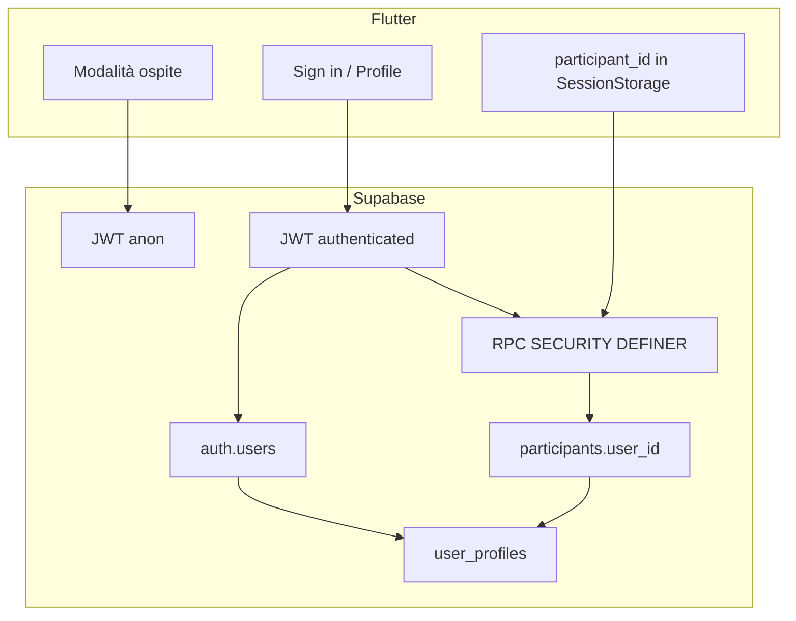

# Fase 19 — Identità e Supabase Auth (foundation)

**Punti:** #89 Supabase Auth · #90 Ospite + link account · #91 Profilo utente · #96 Hardening RPC (MVP)  
**Branch suggerito:** `feat/identity-auth`  
**Durata stimata:** 8–12 giorni  
**Dipende da:** [Fase 18](phase-18-enterprise-readiness.md) (completata)

Elenco riepilogativo: [IMPROVEMENTS-V10.md](../IMPROVEMENTS-V10.md).

## Obiettivo

Introdurre **autenticazione opzionale** con Supabase Auth mantenendo il percorso attuale (nickname + codice). Collegare, quando l’utente lo desidera, la sessione in-app (`participant_id`) a un’identità verificata (`auth.users` / profilo). Avviare l’evoluzione del modello di sicurezza verso RPC che riconoscono sia ospiti sia utenti autenticati.

---

## Principi di design

### Dual-mode (ospite + autenticato)

| Modalità | JWT Supabase | Identità | Capacità in stanza |
|----------|--------------|----------|-------------------|
| **Ospite** (default) | `anon` | Solo `participant_id` + nickname | Come oggi |
| **Autenticato** | `authenticated` | `auth.uid()` + profilo | Stesso + sync profilo, workspace cloud, audit forte (fasi successive) |

### Capability token invariato

`participant_id` resta il parametro delle RPC in-room (`cast_vote`, `perform_reveal`, …). Le funzioni aggiungono, quando presente, il vincolo `participants.user_id = auth.uid()` per impedire impersonation tra utenti loggati.

### Nessuna regressione frictionless

- Create/join stanza **senza** account.
- Banner / sheet “Salva il tuo profilo” **dopo** prima sessione o da impostazioni — mai modale bloccante al cold start.

---

## Ordine di implementazione

| Sprint | Punti | Focus |
|--------|-------|--------|
| 1 | #89 | Auth UI, init client, callback OAuth web, magic link |
| 2 | #90, #91 | Link participant↔user, profilo, prefs migrate |
| 3 | #96 (MVP) | Migration schema + helper `assert_participant_owner` su RPC critiche |

**Migration SQL** (ordine suggerito):

1. `user_profiles` — `id` = `auth.users.id`, display_name, avatar_url, locale, created_at
2. `participants.user_id` — FK nullable verso `auth.users`
3. `link_participant_to_user` — RPC idempotente post-login
4. Patch RPC ad alto rischio: `set_participant_role`, `transfer_facilitator`, `set_final_estimate`, `remove_participant` (lista da allineare in code review)

Aggiornare [supabase/README.md](../../supabase/README.md).

---

## #89 Supabase Auth (email + OAuth)

### Provider (MVP)

| Provider | Uso |
|----------|-----|
| Email magic link | Default B2B senza password |
| Google | Adozione rapida team tech |
| Microsoft (Azure AD) | Aziende Microsoft 365 |

Configurazione dashboard Supabase: redirect URL Vercel produzione + preview + `io.supabase.spritzplanning://` (Android se abilitato).

### Modifiche Flutter previste

| Area | Modifica |
|------|----------|
| `lib/data/supabase/supabase_client.dart` | `authOptions` con deep link / session persistence (già parziale per test) |
| `lib/features/auth/` (nuovo) | `sign_in_screen.dart`, `auth_callback_handler` (web route `/auth/callback`) |
| `lib/app/router.dart` | Route auth + redirect se deep link |
| `home_screen.dart` | Entry “Accedi” / avatar se sessione auth |
| `env.json.example` | Documentare eventuali redirect; **nessuna** service role nel client |

### Modifiche backend

- Abilitare provider in Supabase Auth.
- Trigger opzionale `on_auth_user_created` → insert `user_profiles`.
- GRANT esistenti: mantenere `anon` + estendere policy dove serve solo `authenticated` per tabelle profilo.

### Verifica

- [ ] Magic link completa il login su web preview
- [ ] OAuth Google/Microsoft su desktop web
- [ ] Logout pulisce sessione auth senza cancellare `participant_id` locale in stanza aperta
- [ ] Integration test: `EmptyLocalStorage` / auth in-memory come oggi

---

## #90 Ospite + collegamento account

### Flussi UX

1. **Post-join:** snackbar “Collega un account per salvare workspace e report” → sheet login.
2. **Da impostazioni home:** stesso sheet; se già in stanza, chiama `link_participant_to_user`.
3. **Rejoin:** utente autenticato che reinserisce codice stanza → `join_room` imposta `user_id` se nickname coincide o nuovo participant legato.

### RPC `link_participant_to_user(p_participant_id UUID)`

- Richiede `auth.uid() IS NOT NULL`.
- Verifica participant esiste e `user_id IS NULL` (o stesso user).
- `UPDATE participants SET user_id = auth.uid()`.
- Opzionale: merge nickname nel profilo se display_name vuoto.

### Verifica

- [ ] Link durante sessione attiva senza disconnessione realtime
- [ ] Secondo dispositivo: stesso user può vedere stanze/workspace (prep fase 20)
- [ ] Ospite non autenticato: zero chiamate obbligatorie a Auth

---

## #91 Profilo utente persistente

### Schema `user_profiles`

| Campo | Note |
|-------|------|
| `id` | PK = `auth.users.id` |
| `display_name` | Default da email o nickname al link |
| `avatar_url` | Storage bucket `avatars` (opzionale sprint 2) |
| `preferred_locale` | `it` / `en` — sync con prefs app |
| `updated_at` | touch on save |

### UI

- Sheet profilo da home (avatar, nome, lingua, logout).
- Sostituisce gradualmente solo-nickname come identità **fuori** stanza; in stanza resta il nickname visibile al tavolo.

### Verifica

- [ ] Modifica display name riflessa in home
- [ ] Preferenza lingua applicata al prossimo cold start
- [ ] ARB: copy bar (“Il tuo nome al bancone”, “Account”, no “login Scrum”)

---

## #96 Hardening RPC/RLS (MVP fase 19)

### Modello ibrido

```sql
-- Pseudocodice helper
assert_participant_access(p_participant_id UUID) RETURNS UUID
-- 1) participant exists → room_id
-- 2) IF participant.user_id IS NOT NULL THEN
--      require auth.uid() = participant.user_id
--    ELSE
--      allow anon/authenticated (comportamento legacy)
```

### RPC da patchare in Fase 19 (minimo vitale)

- Moderazione: `set_participant_role`, `transfer_facilitator`, `remove_participant`
- Stima: `set_final_estimate`, `perform_reveal`
- Stanza: `update_room_settings`, `close_room` (se presente)

### Fuori scope Fase 19 (Fase 20)

- RLS row-level su `rooms` per owner org
- Rate limit `create_room` per `auth.uid()`
- Revoca capability se user disabilitato

### Verifica

- [ ] Utente A non può usare `participant_id` di utente B se entrambi hanno `user_id`
- [ ] Sessioni ospite: test di regressione integration esistenti passano
- [ ] Nessun secret aggiuntivo nel bundle Flutter

---

## Architettura (diagramma)



---

## Sicurezza e privacy

| Regola | Dettaglio |
|--------|-----------|
| Sentry | Mai `email`, `auth.uid()` in tag custom senza hash; vedi [AGENT-PLAYBOOK.md](../AGENT-PLAYBOOK.md) |
| Audit | Fase 19: aggiungere `user_id` opzionale in metadata audit (#97 completo in Fase 20) |
| Email | Solo in Auth UI; non esporre in liste partecipanti stanza |
| PIN stanza | Invariato; auth non sostituisce PIN |

---

## Test plan

- [ ] Unit: helper link profilo, parser session auth state
- [ ] Widget: sign-in sheet, profilo
- [ ] Integration: create/join/vote come ospite (nessuna regressione)
- [ ] Integration (opzionale): login test user Supabase → link participant
- [ ] `flutter analyze --fatal-infos` + `flutter test`

---

## Criteri di done fase

- [ ] #89, #90, #91, #96 (MVP) implementati
- [ ] Documentazione AGENTS.md aggiornata (“login opzionale”)
- [ ] Migration applicate su preview/prod
- [ ] Copy IT/EN in ARB
- [ ] Nessun lock su flussi core per utenti non autenticati

---

## Rischi e decisioni aperti

| Tema | Opzioni | Raccomandazione |
|------|---------|-----------------|
| Password vs solo magic link | Password tradizionale | Solo magic link in MVP |
| Un user, più participant nella stessa stanza | Vietato / permesso | Vietato (unique room_id + user_id) |
| Eliminazione account GDPR | Edge Function + soft delete | Backlog post–Fase 20 |
| Apple Sign In | Richiesto se login social iOS store | Valutare se ship iOS consumer |

---

## Riferimenti

- [Supabase Auth Flutter](https://supabase.com/docs/guides/auth/quickstarts/flutter)
- [Supabase SSO (SAML)](https://supabase.com/docs/guides/auth/enterprise-sso) → Fase 21
- Piano org/billing: [phase-20-organizations-entitlements.md](phase-20-organizations-entitlements.md)
