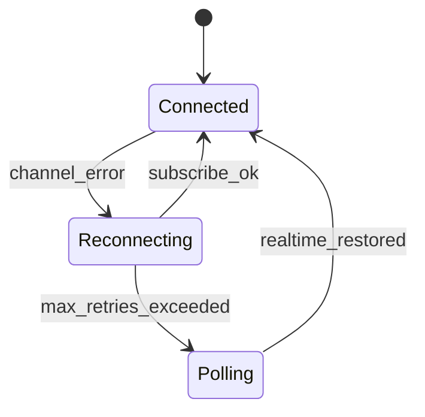

# Fase 2 — Realtime resiliente

**Punto:** #2 Riconnessione Realtime  
**Branch suggerito:** `feat/realtime-resilience`  
**Durata stimata:** 2–3 giorni  
**Dipende da:** [Fase 1](phase-1-security-ci.md) (consigliata)

## Obiettivo

Gestire disconnessioni WebSocket senza stato UI obsoleto; recovery automatico senza reload della pagina.

## Architettura



| Stato | Comportamento |
|-------|----------------|
| `connected` | Realtime attivo, nessun banner |
| `reconnecting` | Retry subscribe (1s, 2s, 4s) |
| `polling` | `fetchRoomState` ogni 5s |
| `disconnected` | Errori persistenti, banner + CTA manuale |

## File da creare/modificare

### Nuovo: `lib/data/repositories/realtime_connection_manager.dart`

- Gestisce `RealtimeChannel` lifecycle
- Espone `Stream<ConnectionStatus>`
- Max 3 retry con backoff esponenziale
- Fallback `Timer.periodic` → refresh room state
- On successo reconnect: stop polling, emit full state

### Modifica: `lib/data/repositories/room_repository.dart`

- Delegare `subscribeToRoom` / `unsubscribe` al manager
- Esporre `Stream<ConnectionStatus> get connectionStatusStream`

### Modifica: `lib/data/providers/providers.dart`

```dart
final connectionStatusProvider = StreamProvider<ConnectionStatus>((ref) {
  return ref.watch(roomRepositoryProvider).connectionStatusStream;
});
```

### Modifica: `lib/shared/widgets/connection_banner.dart`

Messaggi (italiano, tema bar):

| Stato | Messaggio |
|-------|-----------|
| reconnecting | Riconnessione al bancone… |
| polling | Sincronizzazione in corso… |
| disconnected | Connessione persa al bancone |

- Pulsante **Aggiorna** → `roomStateProvider.notifier.refresh()`
- Icona spinner durante reconnect

### Modifica: `lib/features/lobby/room_screen.dart`

- `Consumer` su `connectionStatusProvider`
- Banner sotto `AppBar` quando stato ≠ `connected`

## Test manuali

1. Apri stanza su 2 tab/browser
2. DevTools → Offline
3. Vota su tab A → tab B deve aggiornarsi entro ~10s dopo Online
4. Verificare banner durante offline

## Criteri di done

- [ ] Nessun crash su disconnect/reconnect
- [ ] Voti e partecipanti sincronizzati dopo recovery
- [ ] `flutter analyze` e `test` verdi
- [ ] Banner non invasivo quando connesso

## Rischi

| Rischio | Mitigazione |
|---------|-------------|
| Doppio refresh (Realtime + polling) | Disabilitare polling quando channel `subscribed` |
| Memory leak su channel | `dispose` in `RoomRepository` e provider |
