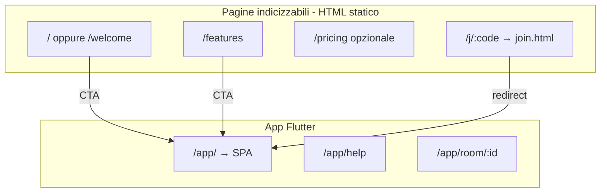

# Fase 22 — Landing page e fondamenta SEO

**Punti:** #99–#102, #106 (MVP) · opz. #107 in parallelo  
**Branch suggerito:** `feat/seo-landing`  
**Durata stimata:** 5–8 giorni  
**Dipende da:** deploy Vercel produzione (`spritz-planning.vercel.app`)

Elenco: [IMPROVEMENTS-V11.md](../IMPROVEMENTS-V11.md).

> **SSO vs SEO:** questo piano è per **motori di ricerca** (Google, Bing). Il login SSO aziendale (#98) resta in [phase-21-enterprise-sso.md](phase-21-enterprise-sso.md) e non è richiesto per essere “trovabili” online.

---

## Obiettivo

Quando qualcuno cerca *planning poker online*, *stima story agile* o simili, deve poter:

1. Atterrare su una **landing** chiara (cos’è, perché usarlo, CTA “Apri il bancone”).
2. Far sì che i **crawler** leggano titoli, descrizioni e link senza eseguire tutta l’app Flutter.
3. Avere gli **strumenti operativi** (Search Console, sitemap) per monitorare e correggere.

Il flusso app (nickname + codice, stanza, voto) **non cambia**; l’app può restare su `/app` o `/` con redirect intelligente.

---

## Perché Flutter web da solo non basta (in breve)

| Aspetto | Comportamento tipico | Cosa fare |
|---------|---------------------|-----------|
| Rendering | Flutter monta l’UI in JavaScript dopo il load | HTML statico o prerender per URL pubblici |
| `index.html` | Un set di meta fisso | Meta diversi per landing vs join vs help |
| Link interni | Router client-side | `<a href>` reali nella landing e nel noscript |
| Condivisione social | OG già parziale in `index.html` | URL assoluti per `og:image`, titoli per pagina |

**Modello già valido nel repo:** `web/join.html` + rewrite Vercel `/j/:code` → meta dinamici prima del redirect all’app.

---

## Architettura proposta



### Opzione routing (scegliere in implementazione)

| Opzione | Pro | Contro |
|---------|-----|--------|
| **A** — Landing su `/`, app su `/app/*` | Massima SEO sulla root | Refactor `go_router` + link interni |
| **B** — Landing su `/welcome`, `/` resta app | Cambio minimo all’app | Root meno “marketing” per Google |
| **C** — Solo `index.html` arricchito + noscript, no split URL | Veloce | Indicizzazione limitata |

**Raccomandazione:** **Opzione A** (landing root + app sotto `/app`) oppure **ibrido**: file statico `web/landing.html` servito su `/` via Vercel rewrite e Flutter solo sotto `/app/**`.

---

## Scope Fase 22 (MVP)

| In scope | Fuori scope (Fase 23+) |
|----------|-------------------------|
| Landing IT/EN (hero, benefit, CTA, footer link) | Blog, case study, changelog pubblico |
| `robots.txt`, `sitemap.xml` | Campagne Ads |
| JSON-LD `WebApplication` + `Organization` | Local SEO |
| Search Console + sitemap submit | ASO Play Store |
| Meta/OG/Twitter corretti (URL assolute) | Prerender di tutte le route Flutter |
| Pagina statica breve “Funzionalità” o sezione nella landing | Pricing reale Stripe |

---

## Requisiti funzionali

### #99 — Landing page

- **Sezioni minime:** hero (H1 + sottotitolo), 3 benefit, “come funziona” (3 step), CTA primaria, CTA secondaria (help), footer (privacy note se analytics).
- **Lingue:** IT (default), EN (`?lang=en` o path `/en/` — decidere in implementazione).
- **Design:** palette bar/spritz esistente; responsive; accessibile (contrasto, focus, heading hierarchy).
- **CTA:** link a `/app` (o avvio app) con testo tipo “Apri il bancone” / “Start a room”.
- **Nessun login obbligatorio** in copy hero (coerente con prodotto).

### #100 — Fondamenta tecniche

File in `web/` (serviti da Vercel):

```text
web/robots.txt          → Allow /, Sitemap: https://spritz-planning.vercel.app/sitemap.xml
web/sitemap.xml         → /, /features, /en/, /help-static se esiste
```

`vercel.json`:

- Rewrite landing vs SPA senza 404 su refresh.
- Header `X-Robots-Tag` solo dove serve (es. `/ops/*` → `noindex`).

**Canonical:** ogni pagina statica con `<link rel="canonical" href="...">`.

### #101 — Meta per route pubbliche

| URL | `title` (esempio IT) | `description` (≤ 160 char) |
|-----|----------------------|------------------------------|
| `/` | SpritzPlanning — Planning poker online per team agile | Stima le story con il team: apri un locale, condividi il codice, vota. Gratis, senza registrazione. |
| `/features` | Funzionalità — SpritzPlanning | Deck personalizzabili, report, workspace team, integrazioni. |
| `/j/*` | (già in join.html) | dinamico per codice |

Fix noti da `index.html` attuale:

- `og:image` e `twitter:image` → URL **assoluti** `https://spritz-planning.vercel.app/icons/Icon-512.png`
- `og:url` coerente con canonical

### #102 — Structured data (JSON-LD)

In `<head>` della landing:

```json
{
  "@context": "https://schema.org",
  "@type": "WebApplication",
  "name": "SpritzPlanning",
  "applicationCategory": "BusinessApplication",
  "operatingSystem": "Web",
  "offers": { "@type": "Offer", "price": "0", "priceCurrency": "EUR" },
  "url": "https://spritz-planning.vercel.app/"
}
```

Opzionale: `Organization` con `logo`, `sameAs` (GitHub, LinkedIn quando disponibili).

Validare con [Rich Results Test](https://search.google.com/test/rich-results).

### #106 — Search Console (operativo)

Checklist admin (non codice):

1. Aggiungere proprietà `https://spritz-planning.vercel.app` in [Google Search Console](https://search.google.com/search-console).
2. Verifica dominio: DNS TXT su Vercel **oppure** file HTML in `web/`.
3. Inviare `sitemap.xml`.
4. (Opz.) [Bing Webmaster Tools](https://www.bing.com/webmasters).
5. Monitorare: Copertura, Core Web Vitals, query (dopo 2–4 settimane).

Documentare passi in [AGENT-PLAYBOOK.md](../AGENT-PLAYBOOK.md) §11.

---

## Requisiti tecnici (checklist implementazione)

```
[x] Landing HTML statica in web/ (landing.html, landing-en.html, features.html)
[x] vercel.json: rewrite / → landing, /app → index.html Flutter
[x] Flutter build --base-href /app/ (Vercel + CI)
[x] robots.txt + sitemap.xml in web/
[x] Canonical + hreflang su landing IT/EN
[x] JSON-LD WebApplication + Organization
[x] noscript in index.html app: link a landing e features
[x] /app/room, /app/ops, /app/auth: noindex (header Vercel + meta app)
[ ] Lighthouse su URL landing in CI (opz. job separato da app)
[x] AGENTS.md / supabase README: nota marketing URL vs app URL
[ ] Search Console: sitemap submit (operativo, playbook §11)
```

---

## Contenuti SEO (linee guida copy)

| Elemento | Regola |
|----------|--------|
| H1 | Una sola per pagina; include “planning poker” o “stima agile” |
| H2 | Benefit, come funziona, per chi è |
| Paragrafi | 2–4 frasi; keyword naturali, no stuffing |
| CTA | Verbi d’azione: “Crea locale”, “Entra con codice” |
| Alt text | Immagini hero/icone con descrizione breve |
| Link interni | Landing → features → help → app |

**Pagine da evitare in indice:** `/room/*` (sessioni private), `/ops/*`, callback auth.

---

## Fase 23 (follow-up, non in MVP)

| # | Deliverable |
|---|-------------|
| 103 | `/features`, `/faq`, `/compare` statiche con copy lunga |
| 104 | `hreflang` `it` / `en` + sitemap alternates |
| 105 | Prerender (es. `prerender.io`, o build-time) per `/app/help` |
| 107 | LCP: hero image WebP, font subset, no blocchi render |
| 108 | Plausible o GA4 con banner consenso se UE |

---

## Verifica

- [x] `curl` landing: HTML contiene H1, meta description, JSON-LD
- [ ] [Google Rich Results Test](https://search.google.com/test/rich-results) senza errori critici
- [ ] `robots.txt` e `sitemap.xml` raggiungibili in produzione
- [ ] Search Console: sitemap “Success”
- [ ] Condivisione link `/` su Slack/LinkedIn: anteprima OG corretta
- [ ] App: create/join/vote invariato da `/app`
- [ ] Lighthouse Performance landing ≥ 85 mobile (target 90 in #107)

---

## Criteri di done

- [ ] #99–#102, #106 documentati e in produzione
- [ ] Piano Fase 23 linkato in ROADMAP
- [ ] Nessuna regressione CI (`flutter test`, build web, deploy Vercel)

---

## Riferimenti

- [Google Search Essentials](https://developers.google.com/search/docs/essentials)
- [Schema.org WebApplication](https://schema.org/WebApplication)
- Repo: `web/index.html`, `web/join.html`, `vercel.json`
- Performance: [PERFORMANCE.md](../PERFORMANCE.md)
